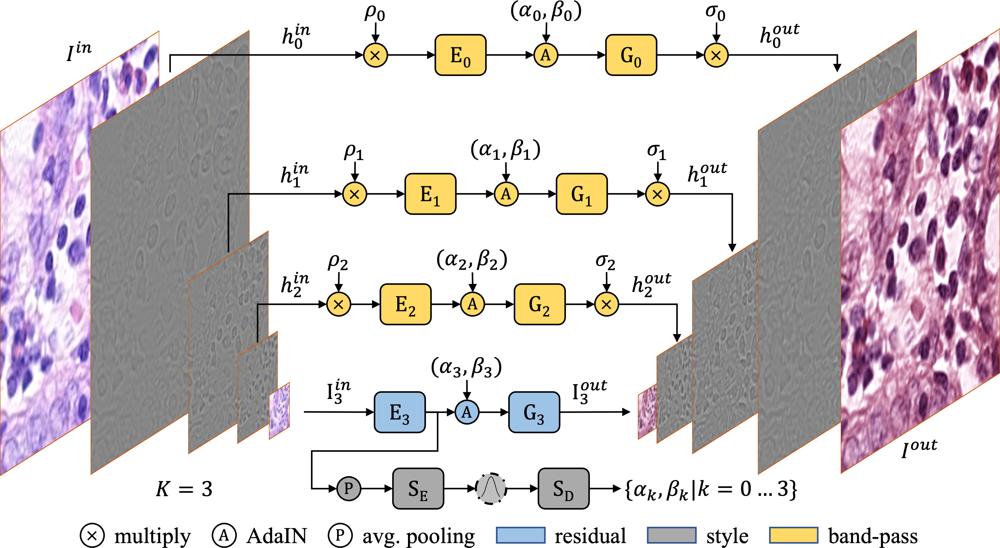

# A Laplacian Pyramid Based Generative H&E Stain Augmentation Network

>  Hematoxylin and Eosin (H&E) staining is a widely used sample preparation procedure for enhancing the saturation of tissue sections and the contrast between nuclei and cytoplasm in histology images for medical diag- nostics. However, various factors, such as the differences in the reagents used, result in high variability in the colors of the stains actually recorded. This variability poses a challenge in achieving generalization for machine-learning based computer-aided diagnostic tools. To desensitize the learned models to stain variations, we propose the Gen- erative Stain Augmentation Network (G-SAN) – a GAN- based framework that augments a collection of cell images with simulated yet realistic stain variations. At its core, G-SAN uses a novel and highly computationally efficient Laplacian Pyramid (LP) based generator architecture, that is capable of disentangling stain from cell morphology. Through the task of patch classification and nucleus seg- mentation, we show that using G-SAN-augmented training data provides on average 15.7% improvement in F1 score and 7.3% improvement in panoptic quality, respectively. 
In this repo, we aim to provide a *minimalistic* demonstration of the G-SAN architecture and its core functionalities.

## Requirements
Install the dependencies using:
```bash
conda create -y -n "gsan" python=3.8 ipython 
conda activate gsan
conda install -y pytorch=1.7.1 torchvision cudatoolkit=10.1 -c pytorch
conda install -y scikit-image
conda install -y opencv -c conda-forge 
```
## Demo
See `demo.ipynb` for concise examples using the pre-trained G-SAN.

## Implementation
This repo is built upon [Imaginaire](https://github.com/NVlabs/imaginaire) from NVIDIA.
